# Manejador de Recetas

Esta es una aplicación **full-stack** para administrar recetas e ingredientes. El stack tecnológico del proyecto es el siguiente:

- **Backend**: Express con Drizzle-ORM y PostgreSQL.
- **Frontend**: React + TailwindCSS

Se utilizan contenedores de Docker para poder levantar rápidamente la base de datos, el servidor y la interfaz gráfica.

---

## Características Principales

- **CRUD de Recetas**:

1. Crear, leer, actualizar (nombre o descripción) y eliminar recetas.
2. Al crear podrás definir la complejidad, momento de comida, nivel de picante y tiempo de preparación de la receta.
3. Puedes relacionar varios ingredientes, utensilios y alergias a una receta.
4. Las recetas se pueden marcar y desmarcar como favoritas.
5. Puedes darle clic al nombre de una receta para visualizar la información detallada de una receta y un historial de cambios que se han dado, esto a través de un modal.

- **CRUD de Ingredientes**:

1. Crear, leer, actualizar (nombre), y eliminar ingredientes.
2. Los ingredientes se listan con la cantidad de recetas a las que están asociados.
3. Puedes seleccionar el nombre para ver el historial de cambios de nombre.

- **Manejo de Usuarios**:

Puedes interactuar con las recetas utilizando diferentes usuarios, por defecto tendrás el usuario 1, pero puedes seleccionar algún otro con el dropdown. Esto afectará las recetas que verás marcadas como favoritas, además, que si quieres poner una valoración para una receta, debes tomar en cuenta que esto solo lo puedes realizar una vez para una receta con un usuario, esto se valida mediante un trigger. También, si creas alguna receta esta aparece al nombre de tu usuario seleccionado.

- **Historial de Cambios**:

Tanto el de ingredientes, como el de recetas funcionan mediante triggers after update, que lo que hacen es que cuando se registra un cambio en el nombre o descripción, hace un insert sobre la tabla de historial, y aquí se podrá evidenciar el valor original contra el que se acaba de colocar.

--- 

## Diagrama Entidad Relación

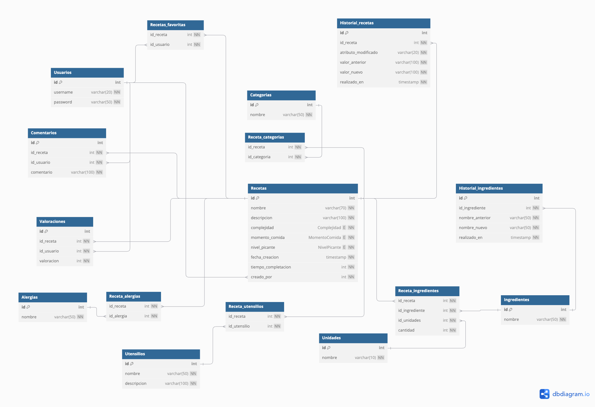

---

## Funcionamiento del Sistema

**Lectura de Ingredientes**

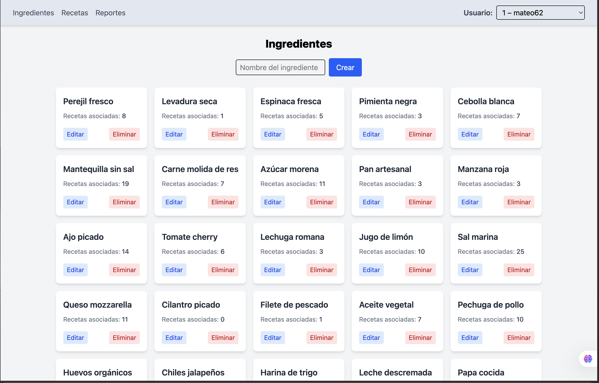

**Edición Nombre Ingredientes**

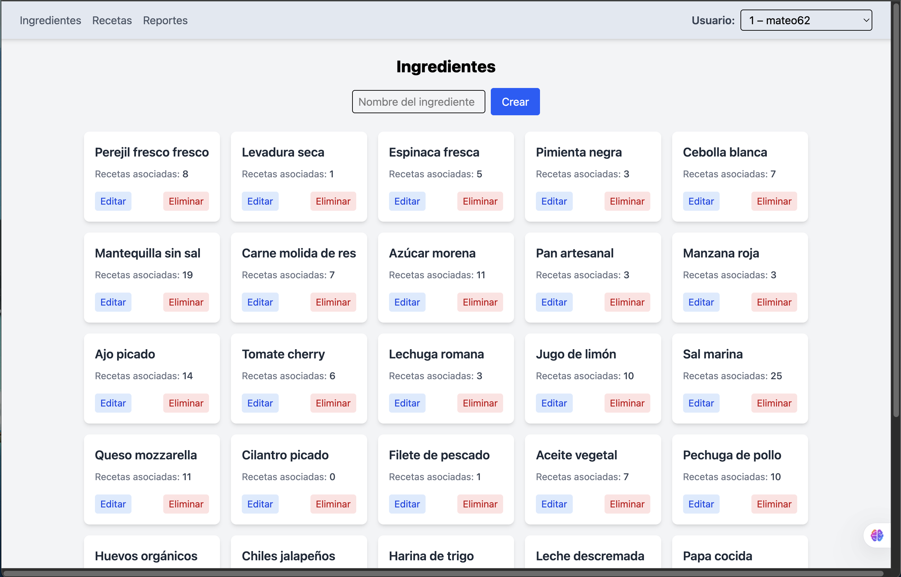

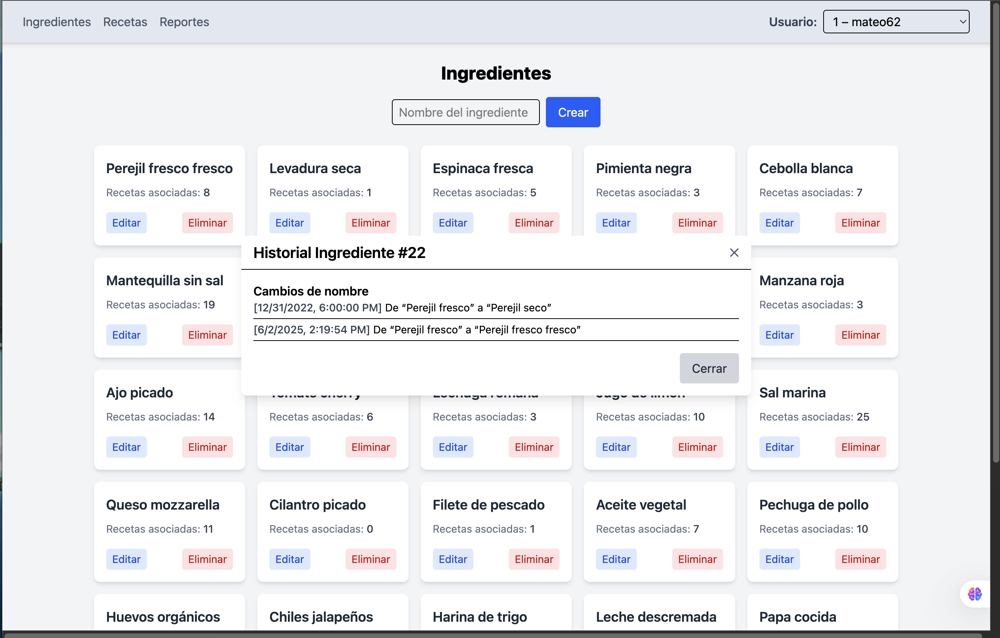

**Crear Ingrediente**

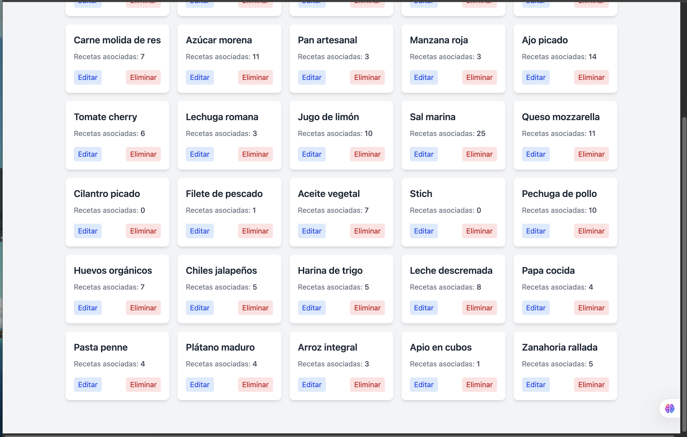

**Borrar Ingrediente**

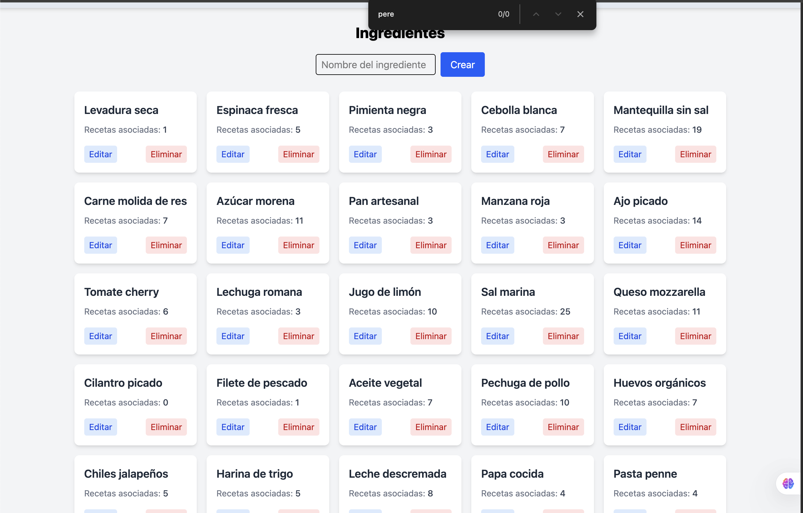

**Crear Receta**

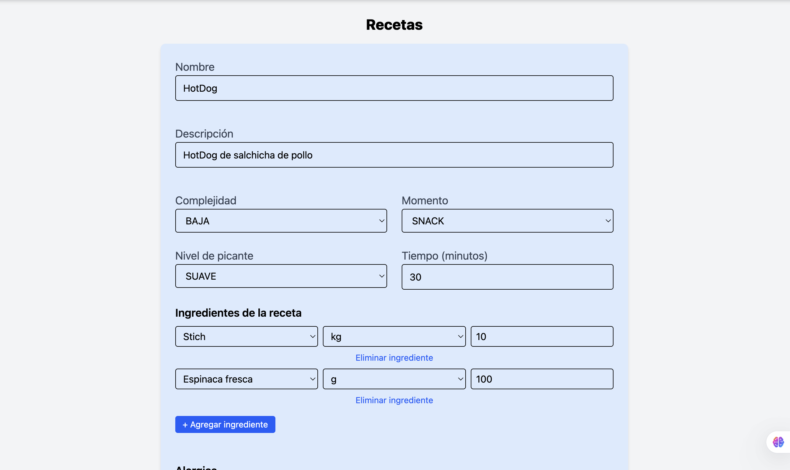

**Actualizar Receta**


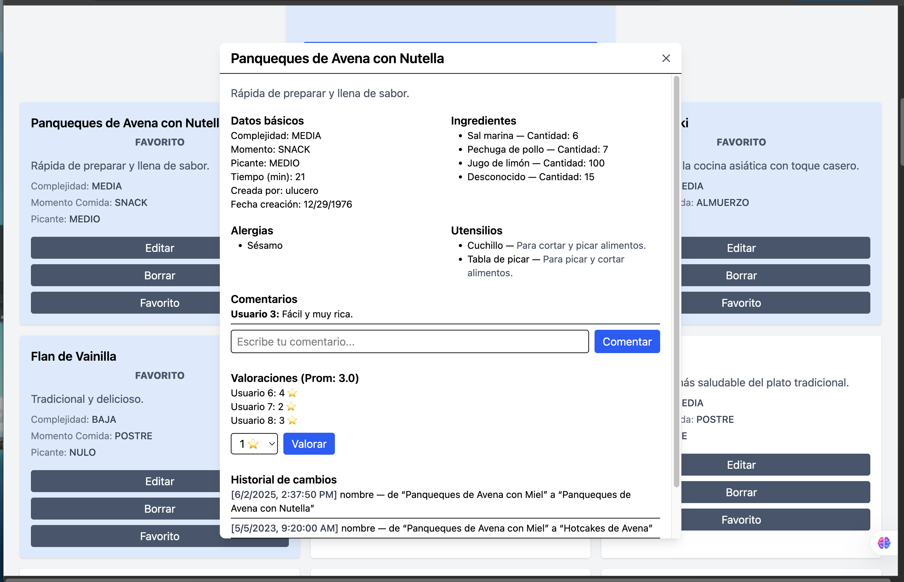

**Leer Receta**

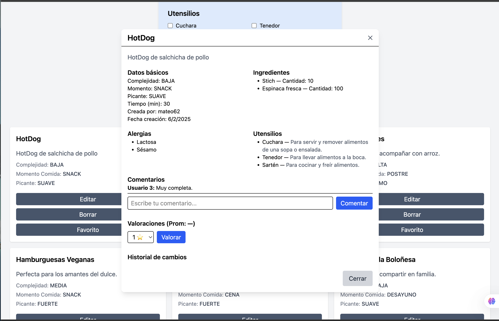

**Borrar Receta**

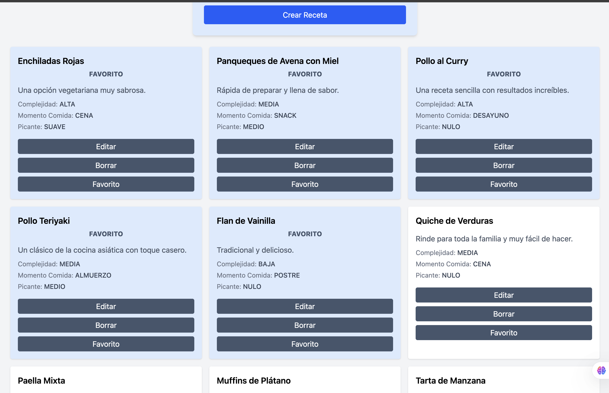

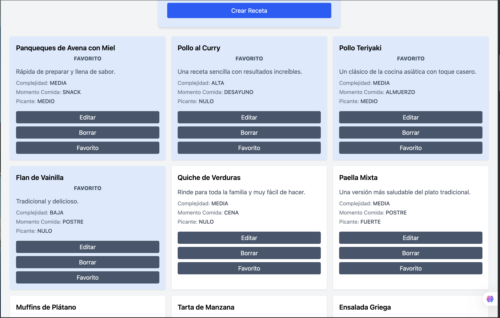

## Correr el Sistema

Se debe contar con Docker instalado para poder levantar los contenedores y así probar la aplicación.

**Pasos a Seguir:**

1. Guardar el docker-compose.example.yml como docker-compose.yml, y aquí se pueden actualizar los puertos que se utilizan en el contenedor, los que se utilizarán de forma local se definen en el .env

```bash
# Guardar el archivo de ejemplo como archivo de configuración activo
cp docker-compose.example.yml docker-compose.yml
```

2. Guardar el .env.example como .env, y aquí se debe garantizar que los puertos que se dejen configurados sean los adecuados para tu máquina (más que todo para evitar tomar uno que ya esté ocupado).

```bash
cp .env.example .env
```

Tras esto, lo único que se debe hacer, es correr el comando:

```bash
docker-compose up --build
```

